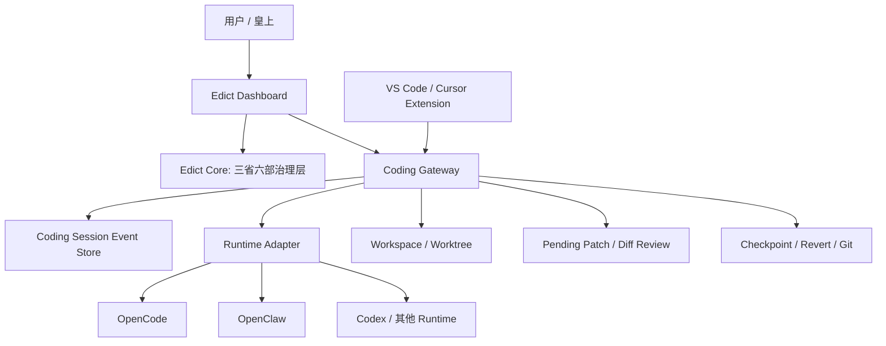

# Edict Coding Cockpit 架构补充与改造路线

## 判断

ChatGPT 分享方案的主方向是正确的：Edict 当前是任务治理看板，不是 IDE 原生 coding agent。若要达到 Claude Code / Cursor 类体验，不能只继续美化 Dashboard，而要补出 Coding Session、事件协议、diff/patch、checkpoint/revert 和 IDE 插件层。

但方案还需要补三点：

1. 先落 Web Cockpit，再做 VS Code 插件。
   直接写插件会把数据协议、运行时适配、UI 交互耦在一起。当前系统已有 `flow_log`、`todos`、`progress_log`、OpenCode storage 和 event ledger，应该先统一成 Web 可验证的 Coding Session API。

2. Patch 审批不能替代治理审批。
   门下省/尚书省的“准奏/封驳”是任务治理审批；patch accept/reject 是文件变更审批。二者要分层，不应混成一个按钮。

3. 输出文件必须按任务组织。
   生成物不是全局文件柜，而是任务证据链的一部分。输出文件、测试报告、diff、命令日志都应归属到同一个 session。

## 目标架构



## 分层职责

### Edict Core

- 接旨、分拣、规划、审核、派发、复核、归档。
- 维护任务状态机和部门职责。
- 决定哪个 Agent/部门执行，不直接管理每一行代码 diff。

### Coding Gateway

- 每个任务创建或绑定一个 coding session。
- 统一采集 tool、file、shell、test、output、patch 事件。
- 为 Dashboard 和 IDE 插件提供同一套 API。

### Runtime Adapter

- OpenCode adapter：读取 OpenCode session/message/part 存储和 server 能力。
- OpenClaw adapter：读取旧 session JSONL 和 progress 命令。
- 未来可加 Codex/Claude Code adapter。

### Patch Review

- Review mode：Agent 生成 pending patch，用户 accept/reject 后再落地。
- Auto mode：低风险文件可自动 apply，但必须生成 checkpoint。
- Governance review 与 patch review 分离。

## 事件协议 MVP

```ts
type CodingEvent =
  | { kind: "todo.item"; status: string; title: string }
  | { kind: "message.progress"; detail: string }
  | { kind: "governance.flow"; title: string; detail: string }
  | { kind: "tool.search"; detail: string }
  | { kind: "file.read"; path: string; detail: string }
  | { kind: "file.change"; path: string; detail: string }
  | { kind: "shell.run"; command: string }
  | { kind: "test.run"; command: string }
  | { kind: "test.result"; status: "pass" | "fail"; detail: string }
  | { kind: "output.file"; path: string }
  | { kind: "output.note"; detail: string };
```

## 已开始落地

- 新增 `GET /api/coding-session/{taskId}`。
- 任务详情新增 Coding Session 驾驶舱。
- 输出文件页已按任务分组。
- 当前先从现有任务数据、OpenCode storage、event ledger 推导 session，后续再切到持久化 event store。

## 后续路线

1. Event Store 固化：把推导结果逐步改成追加写入。
2. File jump：为 `file.read`、`file.change` 增加行号，支持 IDE 跳转。
3. Pending patch：Agent 不直接改主工作区，先生成 patch。
4. Patch API：`/patches/{id}/accept`、`/reject`、`/apply`、`/revert`。
5. Worktree checkpoint：每个任务独立 worktree 或 checkpoint。
6. VS Code 插件 MVP：任务列表、事件流、文件跳转、diff 打开。
7. IDE Cockpit：accept/reject、测试、提交、PR、奏折归档。

## 验收标准

- 任一任务详情能看到 Todo、文件、命令、测试、产物、最近事件。
- 任务输出文件可从任务组进入，而不是全局文件柜里翻找。
- OpenCode/OpenClaw 的底层事件能统一映射到同一个 session schema。
- 后续 IDE 插件不需要重新定义协议，只消费 Coding Gateway API。
