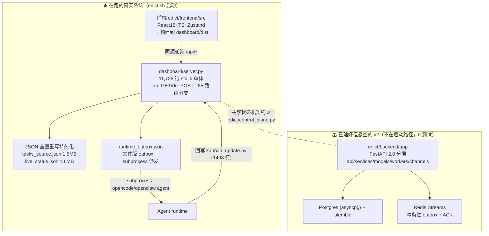

# 三省六部 · Edict —— 架构分析与优化方向报告

> 生成日期：2026-06-15 ·  分析范围：功能 / 流程 / 架构 / 工程债 / 优化路线
> 配套实施计划：[2026-06-15-taskstore-sqlite-migration.md](../superpowers/plans/2026-06-15-taskstore-sqlite-migration.md)

---

## 0. 一句话结论

理念（制度化状态机 + 强制审核 + 完全可观测）和**共享状态机契约**是这个项目的真资产，别动；真正拖后腿的是三件 **P0**：**双后端悬空、万行单体、JSON 全量重写**。最高性价比的一条路是先用 `TaskStore` 接口把单体撬开，把存储换成 SQLite（既治写放大、又不背 Postgres+Redis 的运维债，还能回收 v2 已写好的 models）。

---

## 1. 项目定位

一个**制度化的多 Agent 编排平台**，用唐代「三省六部」官僚体系映射 AI Agent 协作：

```
皇上(User) → 太子(分拣) → 中书省(规划) → 门下省(审议·可封驳) → 尚书省(派发) → 六部(并行执行) → 回奏
```

相比 CrewAI / AutoGen 的「自由协作」，核心差异是：**制度性审核关卡（门下省必审、可封驳反工）+ 完全可观测的实时看板 + 实时可干预（stop/cancel/resume/advance）**。运行时挂在 OpenCode / OpenClaw 上，Python 后端 + React 看板。

设计理念本身有真实价值——它解决了自由协作框架「黑盒、不可审计、不可干预」的痛点。**问题不在理念，而在工程落地的几处结构性债务。**

---

## 2. 架构现状（实际代码，而非文档描述）



**关键事实**

| 维度 | 现状 |
|---|---|
| 生产后端 | `dashboard/server.py`（`edict.sh:178` 启动），11.7k 行 stdlib `http.server` |
| v2 后端 | `edict/backend/app/`（FastAPI+PG+Redis，v2.0.0）**未被任何启动脚本拉起**，`find edict/backend -name 'test_*.py'` = **0** |
| 前端 | 单一前端 `edict/frontend/src` → `vite outDir=../../dashboard/dist` → 由 server.py 静态托管 |
| 状态机 | 单一来源 `edict/control_plane.py`，legacy 与 v2 均 import（`server.py:118`）✅ 无漂移 |
| 持久化 | JSON 文件全量 read-modify-write + 单文件 flock（`file_lock.py`）|
| 派发 | legacy：daemon 线程 + `subprocess.run`；v2：Redis Streams ACK（未上线）|

---

## 3. 做得好的地方（先肯定）

| 优点 | 证据 |
|---|---|
| **状态机契约单一来源** | `edict/control_plane.py` 定义 `STATE_TRANSITIONS`，legacy 与 v2 都 import 它，避免双实现漂移 |
| **outbox 思想已落地两次** | 文件版 `scripts/runtime_outbox.py` 与 DB 版 `task_service.py`（task 与事件同事务原子提交）|
| **并发写有锁** | `transition_state` 用 `SELECT FOR UPDATE`；文件版 `file_lock.py` flock |
| **测试与 CI 有底子** | `tests/` 19 个文件，含状态机一致性、写竞态、CWE-22 路径穿越安全测试；CI 跑 pytest + docker build |
| **可观测性确实强** | flow_log + progress_log + session JSONL 三层融合，是相对竞品的真实差异点 |

---

## 4. 核心问题（按严重度排序）

### 🔴 P0-1 ｜ 双后端分叉，迁移悬空（最大架构债）
在跑的 11.7k 行单体，与建好却没接线、零测试的 FastAPI v2 并存。不是「有旧有新」，而是「**新的没上线、旧的没退役、两边都得改**」。本分支已 `2889 insertions / 4262 deletions`，越拖差距越大、合并成本越高。**必须先做决策：v2 上不上？**（见 §5 方向 A）

### 🔴 P0-2 ｜ `dashboard/server.py` = 11,728 行上帝文件
`do_GET`/`do_POST`（`server.py:11012`/`:11219`）靠 85 个 `self.path ==` 分支手工路由，业务逻辑 / 持久化 / git / 模型探测 / 补丁审查全塞一处。后果：无法单测单个 endpoint、改一处怕牵全身、AI 辅助改它都易超上下文。**即使不上 v2 也必须拆。**

### 🔴 P0-3 ｜ JSON 全量重写持久化，不可持续
`save_tasks` → `atomic_json_write` 把**整个** `tasks_source.json`（当前 1.5MB）read-modify-write 落盘（`server.py:449`）。
- **写放大**：改一个字段 = 重写 1.5MB；
- **并发争用**：调度器 60s 全表扫 + 多派发线程 + Agent 回写，全压单文件锁；
- **无界增长**：`audit_log.json` 1MB 无滚动/归档；
- **零查询能力**：任何统计都得全量 load + 内存过滤。

### 🟠 P1-4 ｜ 派发可靠性靠 subprocess + daemon 线程
单体派发本质 `daemon thread → subprocess.run`（架构文档自承「kill -9 丢失一切」）。`runtime_outbox.py` 给了文件级补偿，但消费仍是 subprocess，崩溃/重启时在途派发恢复语义弱。v2 的 Redis Streams ACK 才是正解，但未上线（`dispatch_worker.py:3` 自己写了这个对比）。

### 🟠 P1-5 ｜ 安全边界偏弱
- CORS `allow_origins=["*"] + allow_credentials=True`（`main.py:58`）；
- 架构文档声称「API 层验证请求来源/签名」防 Agent 伪造身份，但代码层实际主要靠状态机兜底，签名校验未在主路径落实；
- `opencode.json` 含密钥（权限 0600 ✅），但 `opencode.json.lock` 0 字节残留文件入库。

### 🟡 P1-6 ｜ 前端靠轮询而非实时推送
`api.ts` 全是 `fetch(no-store)` 同源轮询；v2 有 `/ws` 但 legacy 没用，任务多时 `/api/live-status` 每次吐 1.6MB。

### 🟡 P2-7 ｜ 仓库卫生
`.edict/worktrees/` 有 **4 份** `server.py` 历史副本（各 ~11k 行）被算进代码量；`outputs/`、`test-results/` 大量产物入库；新后端零测试。

---

## 5. 优化方向设计方案

### 方向 A ｜ 先决策：v2 上不上？（一切的前提）

**被忽视的定位冲突**：README 把「Backend: stdlib only / Zero Backend Dependencies / 一键安装」当卖点，而 v2 引入了 Postgres + Redis + asyncpg + SQLAlchemy + alembic——与「零依赖、一键装」直接矛盾。自托管个人/小团队要先跑起 PG+Redis 会劝退用户。

| 档位 | 做法 | 适合谁 | 代价 |
|---|---|---|---|
| A. 全力上 v2 | PG+Redis 成默认 | 多租户 SaaS | 违背「零依赖」卖点，运维门槛陡升，v2 还需补全测试与功能对齐 |
| **B. SQLite 中间态（推荐）** | 持久化换 **SQLite**(WAL)，outbox/audit 进表，Redis 可选 | 自托管个人/小团队（当前真实用户） | 改造中等，**仍零外部依赖**（SQLite 内置），拿到 ACID/并发/查询/有界增长 |
| C. 维持 JSON | 只拆单体不换存储 | 想最小动作 | P0-3 写放大/争用不解 |

**推荐 B 档**。妙处：复用 v2 已写好的 SQLAlchemy models / task_service / outbox 逻辑，只把方言从 Postgres 换 SQLite、Redis Streams 降级为表轮询（或保留为可选）。v2 投入不浪费，又不背 PG+Redis 运维包袱。

### 方向 B ｜ 拆 `server.py` 单体（无论 A 怎么选都要做）
按域切模块，路由用一张表驱动取代 85 个 if/elif：
```
dashboard/
  routes.py          # path → handler 映射表
  handlers/{tasks,activity,models,patches,agents}.py
  store/             # 持久化抽象层 ← 最高杠杆
    base.py          # TaskStore 接口
    json_store.py    # 现有实现（过渡保留）
    sqlite_store.py  # 新实现
```
**先抽 `TaskStore` 接口是最高杠杆的一步**：上层不再直接 `atomic_json_write`，JSON→SQLite 切换就成了换实现类，可灰度、可回滚、可对拍。

### 方向 C ｜ 持久化升级到 SQLite（治本 P0-3）
- `tasks` / `flow_log` / `progress_log` / `audit_log` / `outbox` 各自建表，改一个字段 = 一条 UPDATE，告别 1.5MB 全量重写；
- WAL 模式，读写并发不再单锁串行；
- `audit_log` 天然有界（按时间分区/归档）；
- 统计类 endpoint 改 SQL 聚合，`/api/live-status` 不再吐整文件。

### 方向 D ｜ 派发可靠性
短期（JSON/SQLite 通用）：给 `runtime_outbox` 消费 worker 加**租约(lease)+ 心跳**，崩溃后超租约自动重投；补「在途超时回收」。长期上 SQLite 后，outbox 用 `SELECT ... WHERE status='pending' LIMIT 1` 加行锁消费，语义比文件锁清晰。

### 方向 E ｜ 安全收口
CORS 收紧到配置化白名单；Agent→看板回写加共享 token / HMAC 签名（`kanban_update.py` 带 token，server 校验），把文档承诺落到代码；清理 `opencode.json.lock` 等残留并入 `.gitignore`。

### 方向 F ｜ 前端实时化（收益中等，排后）
高频面板从轮询切 SSE/WebSocket（复用 v2 `/ws`），`/api/live-status` 改增量推送；Zustand store 已在，只需改数据源。

### 方向 G ｜ 仓库卫生（顺手）
`.edict/worktrees/`、`outputs/`、`test-results/` 入 `.gitignore`；给 `edict/backend` 补基础 service 层单测并入 CI。

---

## 6. 推进节奏

| 阶段 | 动作 | 目标 |
|---|---|---|
| **P0（先做）** | ① 决策方向 A（推荐 SQLite 中间态）② 抽 `TaskStore` 接口 ③ 按域拆 server.py 路由 | 止血：可测、可改、可换存储 |
| **P1** | ④ JSON→SQLite 落地（复用 v2 models）⑤ 派发租约+超时回收 ⑥ CORS/签名安全收口 | 治本：并发、可靠、安全 |
| **P2** | ⑦ 前端 WS 实时化 ⑧ 补后端测试入 CI ⑨ 仓库卫生 | 提质：体验与可维护性 |

> P0 的 ②③ 已细化为可执行实施计划：[TaskStore 抽象 + SQLite 迁移](../superpowers/plans/2026-06-15-taskstore-sqlite-migration.md)（含表结构、对拍测试、灰度开关）。
